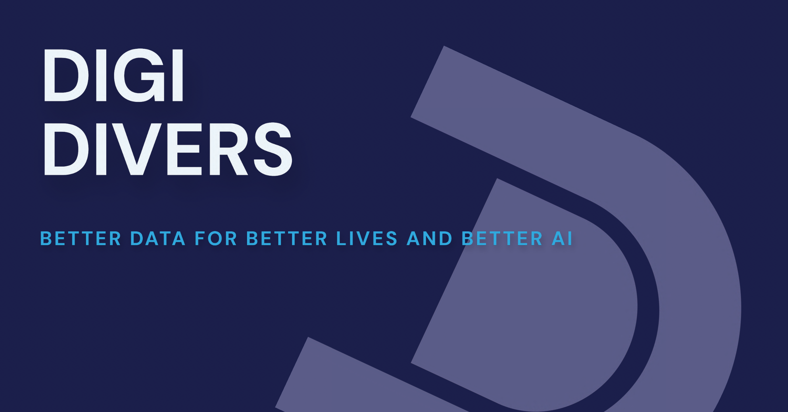

# Digi Divers

## About

"Digi Divers" is a gamified, peer-to-peer data annotation platform that leverages Solana smart contracts. It offers an efficient, cost-effective approach to data annotation by rewarding users for accurate annotations and penalizing incorrect ones. The platform utilizes technologies like SMS for accessibility, AWS for infrastructure, and programmable NFTs for rewards, targeting markets with lower incomes and high internet usage to provide income opportunities through data annotation.

This project won the University prize for $20,000 at the Solana Grizzlython, which was a hackathon comprised of over 10,000 participants.

## Demo Video

Click [here](https://youtu.be/KwwgbnTwuNo?si=ZgZIzQF961VzXrfV) to watch the demo video.

## Repository Guide

### `DigiDiversMobile/`

Description: The mobile app game that allows users to label data.
Skills: React Native, Mobile Development, Typescript.

### `DigiDiversWeb/`

Description: The web application that lets data providers connect their wallets and upload unlabeled data.
Skills: Next.js, Web Development, Typescript.

### `DigiDiversServer/`

Description: The backend server to manage the logic between the mobile app and web app.
Skills: Node.js, Express.js, REST API, PostgreSQL, Typescript.

### `DigiDiversDemoModel/`

Description: An image classification AI model.
Skills: Machine Learning, Image Processing, Python.
